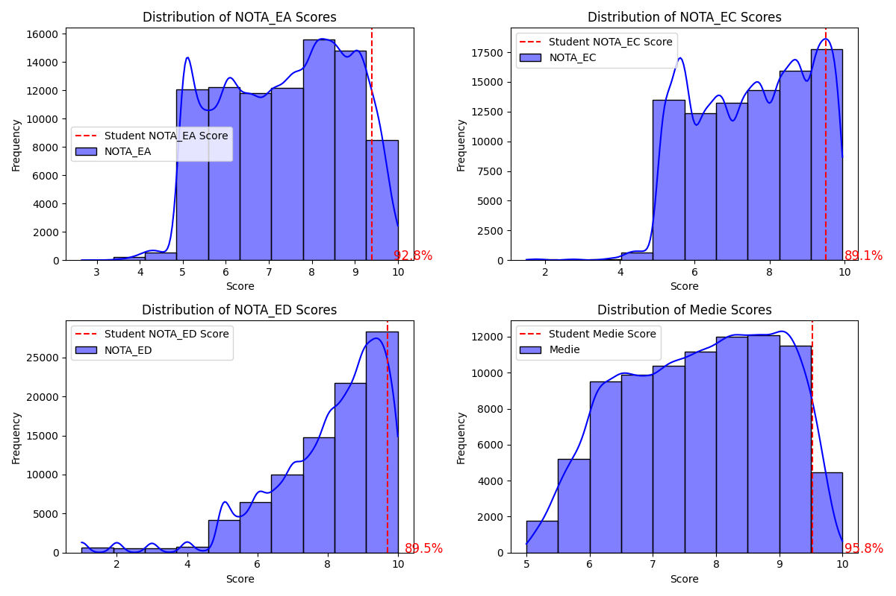
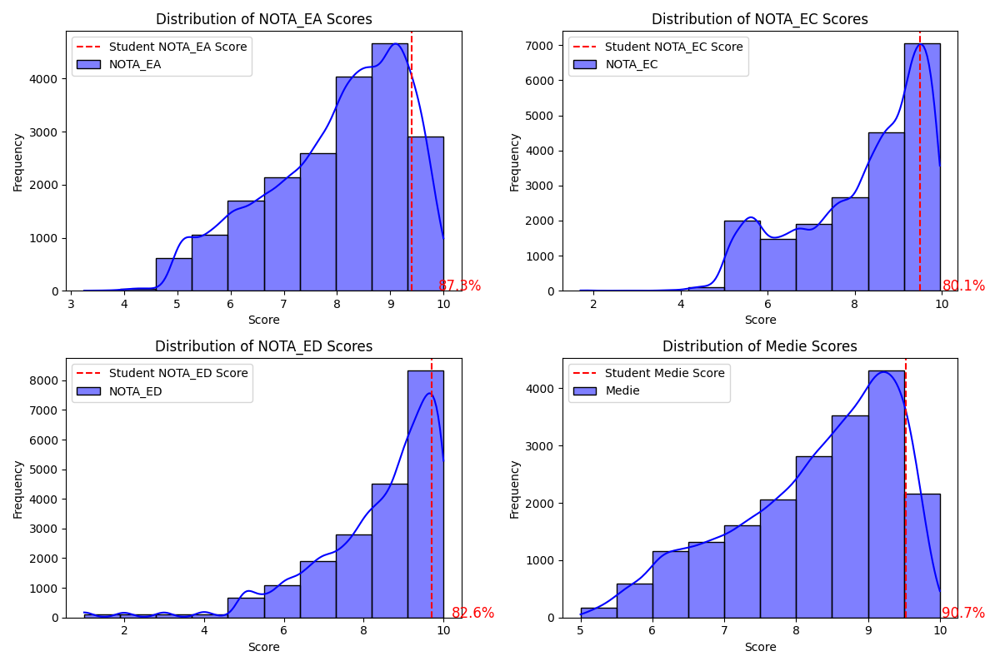
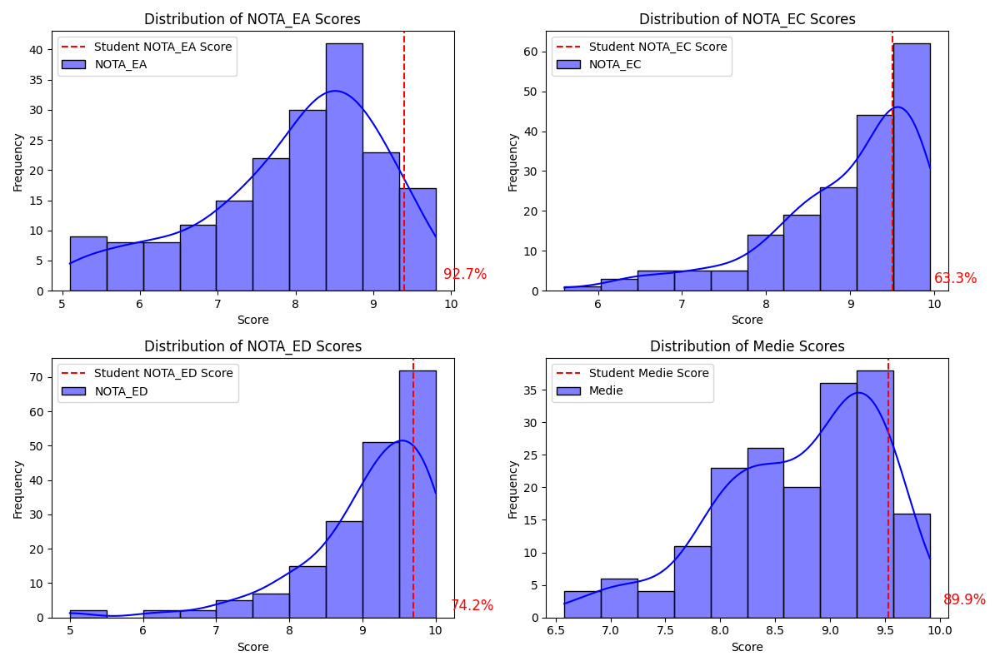
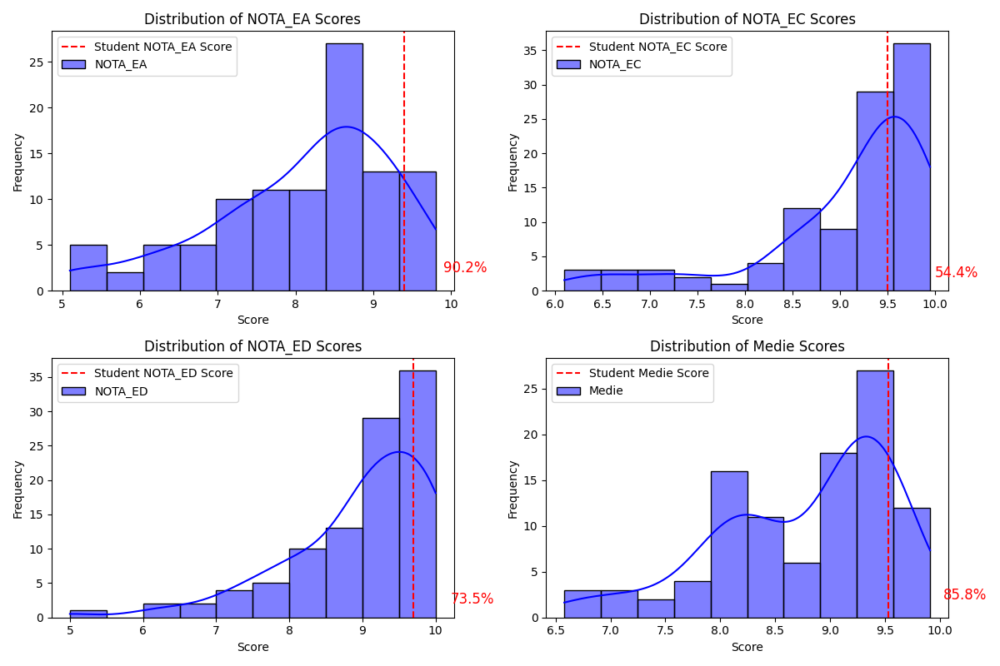

## bac_results_2016

A quick project to assess where my bac results were compared to scores nation and school-wide

Results are: 

Nation-wide:
- 92 percentile in native language
- 89 percentile in specialization discipline (maths or history)
- 95 percentile overall

Nation-wide (math-info specialization only):
- 87.3 percentile in native language
- 80 percentile in maths
- 90.7 percentile overall

High-school: 
- 90.2 percentile in native language
- 54.4 percentile in maths
- 85.8 percentile overall

High-school (math-info only): 

Classroom 
