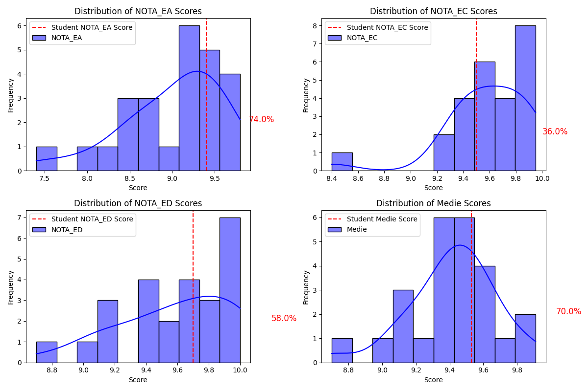

## bac_results_2016

A quick project to assess where my bac results were compared to scores nation and school-wide
NOTA_EA = Romanian language
NOTA_EC = Specialization (**Maths** / History)
NOTA_ED = Choice discipline (**Physics** / Chemistry / etc...)
Medie = Average score 

Results are: 

Nation-wide:
- 92 percentile in native language
- 89 percentile in specialization discipline (maths or history)
- 95 percentile overall

Nation-wide (math-info specialization only):
- 87.3 percentile in native language
- 80 percentile in maths
- 90.7 percentile overall

High-school: 
- 90.2 percentile in native language
- 54.4 percentile in maths
- 85.8 percentile overall

High-school (math-info only): 

Classroom 

---

Please note that these results are extremely preliminary, as more preprocessing is needed on the raw dataset to:
- properly repair some scores (currently, some scores are higher than 10, those rows were droped)
- consider scores after appeal, currently only the first scores for the 3 disciplines were compared
- although first scores were compared, the final average (Medie) considers the final scores for each discipline
- decision to be taken if to keep or remove those who also take test in another native language (their test scores are extremely skewed because they do very poorly in romanian test)